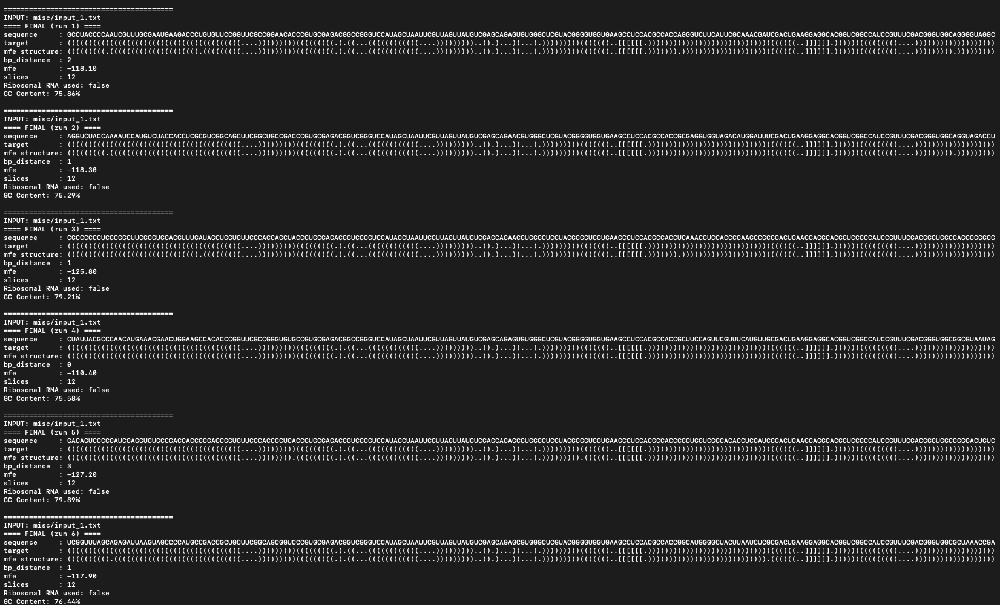

# Ribologic RNA Mutation Program

**Team Aarhus University 2026 – Software**

A Rust-based RNA sequence design tool built on the [ViennaRNA](https://www.tbi.univie.ac.at/RNA/) library. The program uses ViennaRNA folding and minimum-free-energy (MFE) algorithms to generate RNA sequences that match a supplied dot-bracket secondary structure.

> **Using an AI assistant (e.g. Claude Code)?** Please read [.claude/RESPONSIBLE_AI_USE.md](.claude/RESPONSIBLE_AI_USE.md) first. You remain fully responsible for everything you commit: don't misrepresent what your tool does, never commit secrets, and review every change.

## Description

Given a target RNA secondary structure in dot-bracket notation, the tool searches for sequences that fold into that structure. It runs several rounds of a multi-start hill-climbing design procedure, in parallel, and reports the best candidates.

<!-- TODO: add a link to the team wiki here -->

### Features

The program supports two sequence-generation modes:

1. **Generate from ambiguous nucleotides**
   Generate sequences from an input sequence containing ambiguous RNA nucleotide symbols such as:

   - `N` — any nucleotide
   - `K` — `G` or `U`
   - `S` — `G` or `C`

2. **Generate from a preferred starting sequence**
   When `RIBOSOMAL_RNA=True` is enabled in the program configuration, generation begins from the ribosomal large-subunit rRNA sequence, or any other query sequence of your choice.

   The output includes a percentage score indicating how much of the original sequence remains in the generated sequence.
   Note that with this method the program uses longer time converging towards target structure, or might not quite reach it at all (`bp_distance > 0`)

Other features:

- Configurable number of design rounds and parallel runs.
- Optional scrollable in-terminal viewer for the results, so you don't have to open multiple output files to find a candidate.
- Cross-platform: macOS (Intel and Apple Silicon), Linux, and Windows.

> **Note:** The `Python/` folder and Python script are legacy files and are not used by the current program.

## Troubleshooting

| Problem | Fix |
|---|---|
| Build fails with tiny "pointer" files in `vendor/` or linker errors about `libRNA.a` | You cloned without Git LFS. Run `git lfs install && git lfs pull`. |
| `setup.sh` fails on Windows | Use the **"MSYS2 MinGW x64"** terminal. PowerShell, CMD, Git Bash, WSL and the plain MSYS2 shell won't work. |
| `bindgen` error about `libclang` (Linux) | Install `clang` and `libclang-dev` (see Requirements). |
| `cargo: command not found` | Install Rust, then run `source "$HOME/.cargo/env"` or restart your terminal. |
| Setup seems frozen on an Intel Mac | Homebrew is likely compiling dependencies from source (e.g. LLVM). This can take a long time. Let it finish. |
| Program uses all my CPU cores | Lower the number of parallel runs at the second prompt. |


### Supported platforms

`setup.sh` detects your OS/CPU and stages the correct prebuilt (or freshly built) native libraries automatically.

| Platform | Architecture | Status |
|---|---|---|
| macOS | Intel (`x86_64-apple-darwin`) | Tested in CI |
| macOS | Apple Silicon (`aarch64-apple-darwin`) | Tested in CI |
| Linux | `x86_64-unknown-linux-gnu` | Tested in CI |
| Linux | `aarch64-unknown-linux-gnu` | Should be supported by `setup.sh`, but not yet CI-tested |
| Windows | `x86_64-pc-windows-gnu` (via MSYS2 MinGW64) | Tested in CI |
| WSL2 | Treated as Linux | Supported by `setup.sh` |

On macOS and Linux, ViennaRNA is built from source by `setup.sh` if a prebuilt archive is not already present in `vendor/`; GSL, MPFR, and GMP are pulled from your package manager (Homebrew or your Linux distribution's package manager). On Windows, all native libraries (including ViennaRNA) are built from source using MSYS2 MinGW64.

## Installation

### Requirements

#### All platforms

- Git and **Git LFS** (see [Git LFS](#git-lfs-required) below)
- Approximately 500 MB of free disk space for the Rust toolchain and build files

#### macOS

- Intel or Apple Silicon Mac
- Xcode Command Line Tools (`xcode-select --install`)
- Homebrew (installed automatically by `setup.sh` if missing)

> **Intel Macs:** Homebrew no longer provides prebuilt bottles for Intel, so `brew install` may compile dependencies (for example LLVM) from source, which can take a very long time. If a build seems idle, it is usually still compiling.

#### Linux

- `x86_64` or `arm64` Linux
- Rust toolchain
- Clang and `libclang` development files, required by Rust `bindgen`
- A supported package manager: `apt`, `dnf`, `yum`, `pacman`, or `zypper`

For Ubuntu or Debian-based distributions:

```bash
sudo apt-get update
sudo apt-get install -y \
  build-essential \
  clang \
  libclang-dev \
  pkg-config \
  git \
  git-lfs \
  curl
```

#### Windows

- Windows 10/11, `x86_64`
- [MSYS2](https://www.msys2.org/) installed
- Git (available inside the MSYS2 MinGW64 shell, or installed separately)
- The build must be run from the **"MSYS2 MinGW x64"** terminal specifically — not PowerShell, CMD, Git Bash, WSL, or the plain MSYS2 terminal

### Git LFS (required)

The prebuilt native libraries in `vendor/` are large binaries and are stored with [Git LFS](https://git-lfs.com). Install Git LFS **before cloning**, otherwise you will get small pointer files instead of the real libraries and the build will fail.

```bash
# macOS (Apple Silicon)
brew install git-lfs
# macOS (Intel): brew may build from source; download the prebuilt
# darwin-amd64 release from https://github.com/git-lfs/git-lfs/releases instead

# Ubuntu / Debian
sudo apt-get install git-lfs

# Windows (MSYS2 MinGW64)
pacman -S mingw-w64-x86_64-git-lfs

# Then, once per machine:
git lfs install
```

If you already cloned without Git LFS, run this inside the repository:

```bash
git lfs pull
```

### Quick start: macOS

Clone the repository and run the setup script:

```bash
git clone https://gitlab.igem.org/2026/software/aarhus-university/ribologic-rna-sequence-generator.git && cd ribologic-rna-sequence-generator && bash setup.sh
```

The setup script installs required tools when needed and builds the project. This works the same way on Intel and Apple Silicon Macs — `setup.sh` detects your CPU architecture and targets it automatically.

If Rust was not installed automatically, install it with:

```bash
curl --proto '=https' --tlsv1.2 -sSf https://sh.rustup.rs | sh
```

After installation, restart your terminal or load Rust into the current shell:

```bash
source "$HOME/.cargo/env"
```

### Quick start: Linux

Install the system requirements shown above, then install Rust if necessary:

```bash
curl --proto '=https' --tlsv1.2 -sSf https://sh.rustup.rs | sh
source "$HOME/.cargo/env"
```

```bash
git clone https://gitlab.igem.org/2026/software/aarhus-university/ribologic-rna-sequence-generator.git
cd ribologic-rna-sequence-generator
./setup.sh
cargo run
```

This works on both `x86_64` and `arm64` Linux; `setup.sh` detects your architecture and builds ViennaRNA from source if a prebuilt archive isn't already vendored.

### Quick start: Windows (MSYS2 MinGW64)

1. Install [MSYS2](https://www.msys2.org/).
2. Open the **"MSYS2 MinGW x64"** terminal from the Start menu (this specific shell is required).
3. Clone the repository and run the setup script:
   ```bash
   git clone https://gitlab.igem.org/2026/software/aarhus-university/ribologic-rna-sequence-generator.git
   cd ribologic-rna-sequence-generator
   ./setup.sh
   ```
   This installs the MinGW toolchain, GMP, MPFR, and GSL via `pacman`, builds ViennaRNA from source, and adds the `x86_64-pc-windows-gnu` Rust target.
4. Run the program, targeting the GNU toolchain:
   ```bash
   cargo run --target x86_64-pc-windows-gnu
   ```

> Native Windows support currently covers `x86_64` only.

## Usage

Run this command from the repository root, the directory containing `Cargo.toml`:

```bash
cargo run
```

For an optimized release build:

```bash
cargo run --release
```

On Windows, pass `--target x86_64-pc-windows-gnu` to both commands.

When the program starts you will be asked:

1. **How many rounds to run.** Type a number and press Enter. The default is three rounds.
2. **How many runs `multi_start_hill_climb_design()` should execute in parallel.** The default is four. The more parallel runs you choose, the more CPU cores are used, so choose with consideration.

Once the run has finished you can choose to view the results as a scrollable element in the terminal (y/n). This is useful for comparing candidates without opening multiple output files.

### Input and output files

Input files are located in:

```
misc/
```

They are named with the `input_` prefix. Each input file must contain:

- An RNA sequence
- A matching RNA secondary structure in dot-bracket notation

For example:

```
Sequence:  GGGAAACCC
Structure: (((...)))
```

The sequence and structure must have the same length.

Generated output files are written to:

```
misc/output/
```

## Example

**Input**: a file in `misc/` with the `input_` prefix, for example `misc/input_example.txt`:

```
Sequence:  GGGAAACCC
Structure: (((...)))
```

The sequence and structure must be the same length.

**Run**:

```
$ cargo run --release
How many rounds? [3]: 3
How many parallel runs? [4]: 4
```

**Output**: written to `misc/output/`, and viewable in the terminal when asked (y/n):

```
==== FINAL (run 4) ====
sequence      : CUAUUACGCCCAACAUGAAACGAACUGGAAGCCACACCCGGUUCGCCGGGUGUGCCGUGCGAGACGGCCGGGUCCAUAGCUAAUUCGUUAGUUAUGUCGAGCAGAGUGUGGGCUCGUACGGGGUGGUGAAGCCUCCACGCCACCGCUUCCAGUUCGUUUCAUGUUGCGACUGAAGGAGGCACGGUCGGCCAUCCGUUUCGACGGGUGGCGGCGUAAUAG
target        : (((((((((((((((((((((((((((((((((((((((((....)))))))))(((((((((.(.((...((((((((((((....)))))))))..)).)...))...).)))))))))(((((((..[[[[[[.)))))))))))))))))))))))))))))((((((..]]]]]].))))))(((((((((....)))))))))))))))))))
mfe structure : (((((((((((((((((((((((((((((((((((((((((....)))))))))(((((((((.(.((...((((((((((((....)))))))))..)).)...))...).)))))))))(((((((..[[[[[[.)))))))))))))))))))))))))))))((((((..]]]]]].))))))(((((((((....)))))))))))))))))))
bp_distance   : 0
mfe           : -110.40
slices        : 12
Ribosomal RNA used: false
GC Content: 75.58%
```



**Reading the result**: First line displays the generated sequence while target is the desired target structure in dot bracket notation. Below that is the mfe structure which is the final structure the sequence is predicted to have by ViennaRNA. Target and mfe structure might differ which can be seen in the bp_distance. This tells you how many positions is different between the target and predicted structure. Below that again is the mfe (mean free energy) which indicates the stability of the mfe structure. Slices shows how many substructures the sequence were sliced into while Ribosomal RNA used shows which mode the program runs at. If this is set to true a metrics of sequence identity is shown as well. GC content gives an indication of how many GC-pairs which is usually favoured in paired RNA-substructures such as stems and hairpin loops as well as pseudoknots.

**Using a starting sequence**: to begin from a query sequence instead of ambiguous nucleotides, set `RIBOSOMAL_RNA=True` in <!-- FILL IN: file name, e.g. config.toml --> and put your query sequence in <!-- FILL IN: where -->.


## Data and large files

Keep this repository for **source code**. For datasets, machine-learning model weights, large media, and other heavy artifacts, use [Zenodo](https://teams.igem.org/go/deliverables/software/zenodo) — it gives each upload a citable DOI and is the recommended long-term archive for iGEM teams. Reference your Zenodo records from this README so judges and future teams can find them.

The one exception in this repository is the prebuilt native libraries in `vendor/RNAlib/prebuilt/`, which are stored with Git LFS (see [Git LFS](#git-lfs-required)) so the project builds out of the box. Generated results in `misc/output/` should not be committed.

## Contributing

We welcome contributions. To get started:

1. Install the requirements for your platform and Git LFS (see [Installation](#installation)).
2. Clone the repository and run `setup.sh` (see the quick starts above).
3. Create a branch, make your changes, and open a merge request against `main`.

Useful commands:

```bash
cargo build            # debug build
cargo run --release    # optimized build and run
```

### Native dependencies

The project uses the following native libraries:

- **ViennaRNA** — RNA secondary-structure prediction and MFE folding
- **GMP** — GNU Multiple Precision Arithmetic Library
- **MPFR** — multiple-precision floating-point arithmetic
- **GSL** — GNU Scientific Library

On macOS, Linux, and Windows, `setup.sh` builds and/or copies these into a target-specific directory under `vendor/RNAlib/prebuilt/`, for example:

```
vendor/RNAlib/prebuilt/x86_64-unknown-linux-gnu/
vendor/RNAlib/prebuilt/aarch64-apple-darwin/
vendor/RNAlib/prebuilt/x86_64-pc-windows-gnu/
```

The Rust build script (`build.rs`) selects the correct prebuilt library directory for the current target platform and expects the ViennaRNA headers in `vendor/RNAlib/include/ViennaRNA`.

### Continuous integration

Every push and pull request is built and tested across all supported platforms — macOS Intel, macOS Apple Silicon, Linux x86_64, and Windows x86_64 (MSYS2 MinGW64) — using the workflows in `.github/workflows/` (`test-all-platforms.yml` and `build-linux-viennarna.yml`).

### Project structure

```
ribologic-rna-sequence-generator/
├── Cargo.toml
├── Cargo.lock
├── build.rs
├── config.toml
├── setup.sh
├── wrapper.h
├── src/
│   └── main.rs
├── misc/
│   ├── input_*.txt
│   └── output/
├── Python/                         # legacy, unused
├── vendor/
│   └── RNAlib/
│       ├── include/
│       │   └── ViennaRNA/          # ViennaRNA C headers
│       └── prebuilt/               # stored with Git LFS
│           ├── x86_64-apple-darwin/
│           ├── aarch64-apple-darwin/
│           ├── x86_64-unknown-linux-gnu/
│           ├── aarch64-unknown-linux-gnu/
│           └── x86_64-pc-windows-gnu/
│               ├── libRNA.a
│               ├── libgmp.a
│               ├── libmpfr.a
│               ├── libgsl.a
│               └── libgslcblas.a
└── .github/
    └── workflows/
        ├── build-linux-viennarna.yml
        └── test-all-platforms.yml
```

## Authors and acknowledgment

Developed by iGEM Team Aarhus University 2026.

<!-- TODO: list the individual contributors -->

This project builds on the [ViennaRNA Package](https://www.tbi.univie.ac.at/RNA/), and on the GMP, MPFR, and GSL libraries.

## License

This repository is licensed under the [Apache License 2.0](LICENSE) — a permissive open-source license recommended for software (Creative Commons licenses are *not* intended for source code). You are free to use, modify, and distribute this software, provided you keep the license and attribution notices. If you prefer different terms for your own tool, you may replace this license, but it must remain an [OSI-approved open-source license](https://opensource.org/licenses).


## Citation
If you use this tool, please cite the iGEM Aarhus University 2026 team and ViennaRNA:
Lorenz, R. et al. (2011). ViennaRNA Package 2.0. *Algorithms for Molecular Biology*, 6:26.