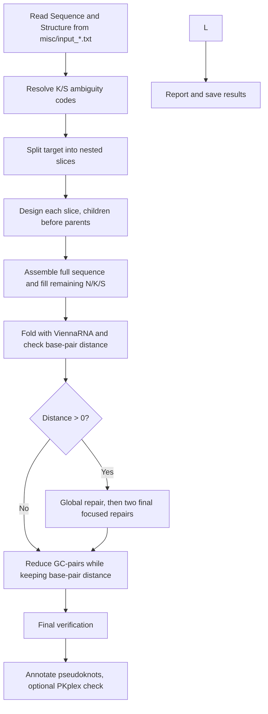
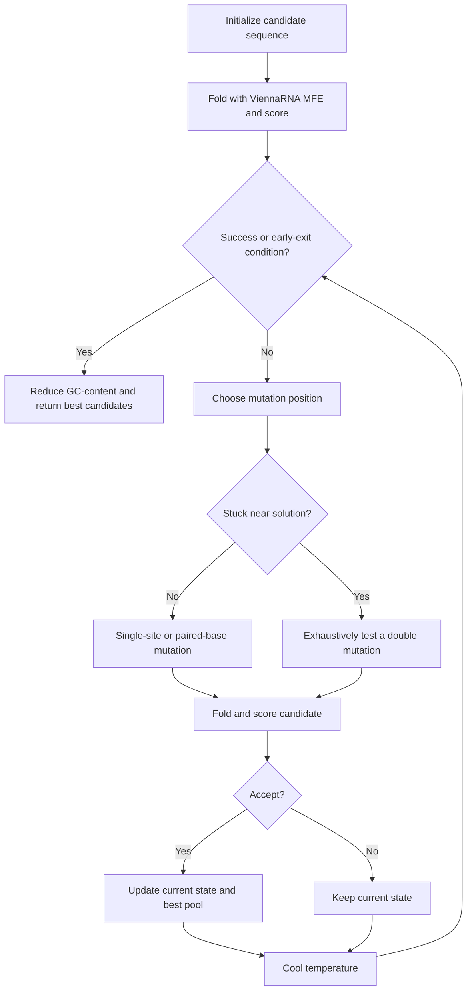

# Ribologic RNA Sequence Generator

**Team Aarhus University 2026 – Software**

A Rust-based RNA sequence design tool built on the [ViennaRNA](https://www.tbi.univie.ac.at/RNA/) library. Given a target RNA secondary structure in dot-bracket notation, it searches for sequences that fold into that structure. It uses ViennaRNA's minimum-free-energy (MFE) folding to score candidates, runs several rounds of a parallel multi-start hill-climbing design procedure, and reports the best results.

Team wiki: https://2026.igem.wiki/aarhus-university/

The program supports two sequence-generation modes:

1. **Generate from ambiguous nucleotides**
   Generate sequences from an input sequence containing ambiguous RNA nucleotide symbols such as:

   - `N` — any nucleotide
   - `K` — `G` or `U`
   - `S` — `G` or `C`

2. **Generate from a preferred starting sequence**
   When `const RIBOSOMAL_RNA : bool = true;` is enabled in the program configuration, generation begins from the ribosomal large-subunit rRNA sequence, or any other query sequence of your choice.

   The output includes a percentage score indicating how much of the original sequence remains in the generated sequence.
   Note that with this method the program uses longer time to converge towards target structure, or might not quite reach it at all (`bp_distance > 0`)

Other features:

- Configurable number of design rounds and parallel runs.
- Optional scrollable in-terminal viewer for the results, so you don't have to open multiple output files to find a candidate.
- Cross-platform: macOS (Intel and Apple Silicon), Linux, and Windows.

> **Note:** The `Python/` folder and Python script are legacy files and are not used by the current program.

## How it works

Ribologic designs sequences in four stages. It splits the target into nested **slices**, designs each slice with a hill-climbing search, repairs the assembled sequence globally, and finally verifies and annotates pseudoknots.



### 1. Slicing the target

ViennaRNA's MFE algorithm (Zuker) runs in O(n³), so folding one long sequence over and over is slow. Instead the target is broken into smaller problems, **slices**, which are solved in parallel:


The `slices` value in the output is the number of slices the target was split into.

### 2. Designing a slice

Each slice is passed to `multi_start_hill_climb_design()`, which runs several independent `hill_climb_design()` searches in parallel (5 by default). Each search works like this:



For slices, the search exits early when the base-pair distance falls below a threshold that depends on the number of designable positions (always below 0.7) and the partition function shows that the remaining nucleotides are only weakly paired.

#### Scoring a candidate

1. **Strip pseudoknots.** ViennaRNA does not fold pseudoknots directly, so `[` and `]` in the target are converted to dots.
2. **Mask fixed bases.** Fixed bases at positions that are unpaired in the target are treated as `N`, for folding only.
3. **Fold.** ViennaRNA computes the MFE structure.
4. **Measure the distance** to the pseudoknot-stripped target with `vrna_bp_distance()`:

```math
D_{\text{VRNA}} = \text{BPDistance}(S_{\text{MFE}},\, S_{\text{target without PK}})
```

Pseudoknot pairs are stored in a pair map, mutated together with the sequence, and scored with a penalty for each invalid pair and wobble-baspair:

```math
D_{\text{candidate}} = D_{\text{VRNA}} + 2 \times N_{\text{invalid PK pairs}}
```

A score of `0` means the candidate folds exactly into the target.

#### Accepting candidates

A candidate replaces the current one if its distance is lower, or if the distance is equal and its free energy is lower (same structure, more stable). A worse candidate is still accepted with probability

```math
P(\text{accept worse}) = \exp\!\left(-\frac{D_{\text{candidate}} - D_{\text{current}}}{T}\right)
```

where the temperature $T$ decreases linearly over time, so the search shifts from exploring to refining. If progress stalls once $T$ reaches its minimum of `0.05`, it is reset to `1`. The cooling rate is set from the number of designable positions.

### 3. Repairing the full sequence

**Global repair.** The best slice designs are assembled into the full sequence and the base-pair distance is recomputed. The remaining mismatched positions are then repaired in parallel for at most 800 iterations, where the iteration count scales with the distance:

```math
\text{repair steps} = \min\left(800,\; \frac{d_{\text{bp}}}{0.008}\right)
```
where $d_{\text{bp}}$ is the base-pair distance of the assembled sequence.

It stops when the iteration limit is reached, or when the distance is below a precomputed threshold and the partition function shows low pair probabilities (about 0.5). A repaired sequence replaces the original only if it improves on it.

**The final focused repairs.** If the distance is still not below 2–3, `multi_start_hill_climb_design()` runs twice more on the remaining mismatches. This time all paired nucleotides start as G–C pairs to favour strong stems. The exit criteria are stricter on pair probabilities (0.1) and looser on distance (3–5), and the iteration count is clamped between 1 and 100.

**GC-cleanup**. After the the final repairs all GC-pairs in the designable positions are attempted substidized for AU-pairs while keeping the base-pair distance unchanged, or reduced. This is to reduce the inflated GC-content which usually ends up at around 80% before this step.

### 4. Pseudoknot verification and annotation

The ViennaRNA MFE structure contains no pseudoknots, so they are reinstated at the target's pseudoknot positions wherever the designed bases can form valid pairs. This should always be the case, since pseudoknot positions are treated as paired during design. The program then runs ViennaRNA's PKplex as a final, separate pseudoknot check.

The reported **MFE structure with PK** is therefore the ViennaRNA MFE structure for the ordinary nested pairs, plus the target's pseudoknot brackets where the sequence supports valid base pairs. It is **not** a full thermodynamic pseudoknot MFE prediction. PKplex output is the separate pseudoknot-oriented check.


### Supported platforms

`setup.sh` detects your OS/CPU and stages the correct prebuilt (or freshly built) native libraries automatically.

| Platform | Architecture | Status |
|---|---|---|
| macOS | Intel (`x86_64-apple-darwin`) | Tested (GitHub mirror CI, plus manual)|
| macOS | Apple Silicon (`aarch64-apple-darwin`) | Tested (GitHub mirror CI) |
| Linux | `x86_64-unknown-linux-gnu` | not yet tested |
| Linux | `aarch64-unknown-linux-gnu` | Should be supported by `setup.sh`, but not yet CI-tested |
| Windows | `x86_64-pc-windows-gnu` (via MSYS2 MinGW64) | Tested (GitHub mirror CI) |
| WSL2 | Treated as Linux | Supported by `setup.sh` |

On macOS and Linux, ViennaRNA is built from source by `setup.sh` if a prebuilt archive is not already present in `vendor/`; GSL, MPFR, and GMP are pulled from your package manager (Homebrew or your Linux distribution's package manager). On Windows, all native libraries (including ViennaRNA) are built from source using MSYS2 MinGW64.

## Installation

### Requirements

#### All platforms

- Git and **Git LFS** (see [Git LFS](#git-lfs-required) below)
- Approximately 500 MB of free disk space for the Rust toolchain and build files

#### macOS

- Intel or Apple Silicon Mac
- Xcode Command Line Tools (`xcode-select --install`)
- Homebrew (installed automatically by `setup.sh` if missing)

> **Intel Macs:** Homebrew no longer provides prebuilt bottles for Intel, so `brew install` may compile dependencies (for example LLVM) from source, which can take a very long time. If a build seems idle, it is usually still compiling.

#### Linux

- `x86_64` or `arm64` Linux
- Rust toolchain
- Clang and `libclang` development files, required by Rust `bindgen`
- A supported package manager: `apt`, `dnf`, `yum`, `pacman`, or `zypper`

For Ubuntu or Debian-based distributions:

```bash
sudo apt-get update
sudo apt-get install -y \
  build-essential \
  clang \
  libclang-dev \
  pkg-config \
  git \
  git-lfs \
  curl
```

#### Windows

- Windows 10/11, `x86_64`
- [MSYS2](https://www.msys2.org/) installed
- Git (available inside the MSYS2 MinGW64 shell, or installed separately)
- The build must be run from the **"MSYS2 MinGW x64"** terminal specifically — not PowerShell, CMD, Git Bash, WSL, or the plain MSYS2 terminal

### Git LFS (required)

The prebuilt native libraries in `vendor/` are large binaries and are stored with [Git LFS](https://git-lfs.com). Install Git LFS **before cloning**, otherwise you will get small pointer files instead of the real libraries and the build will fail.

```bash
# macOS (Apple Silicon)
brew install git-lfs
# macOS (Intel): brew may build from source; download the prebuilt
# darwin-amd64 release from https://github.com/git-lfs/git-lfs/releases instead

# Ubuntu / Debian
sudo apt-get install git-lfs

# Windows (MSYS2 MinGW64)
pacman -S mingw-w64-x86_64-git-lfs

# Then, once per machine:
git lfs install
```

If you already cloned without Git LFS, run this inside the repository:

```bash
git lfs pull
```

### Quick start: macOS

Clone the repository and run the setup script:

```bash
git clone https://gitlab.igem.org/2026/software/aarhus-university/ribologic-rna-sequence-generator.git
cd ribologic-rna-sequence-generator
bash setup.sh
```

The setup script installs required tools when needed and builds the project. This works the same way on Intel and Apple Silicon Macs, because `setup.sh` detects your CPU architecture and targets it automatically.

Then run the program (`--release` is faster):

```bash
cargo run --release
```

If Rust was not installed automatically, install it with:

```bash
curl --proto '=https' --tlsv1.2 -sSf https://sh.rustup.rs | sh
source "$HOME/.cargo/env"
```

### Quick start: Linux

Install the system requirements shown above, then install Rust if necessary:

```bash
curl --proto '=https' --tlsv1.2 -sSf https://sh.rustup.rs | sh
source "$HOME/.cargo/env"
```

```bash
git clone https://gitlab.igem.org/2026/software/aarhus-university/ribologic-rna-sequence-generator.git
cd ribologic-rna-sequence-generator
./setup.sh
cargo run --release
```

This works on both `x86_64` and `arm64` Linux; `setup.sh` detects your architecture and builds ViennaRNA from source if a prebuilt archive isn't already vendored.

### Quick start: Windows (MSYS2 MinGW64)

1. Install [MSYS2](https://www.msys2.org/).
2. Open the **"MSYS2 MinGW x64"** terminal from the Start menu (this specific shell is required).
3. Clone the repository and run the setup script:
   ```bash
   git clone https://gitlab.igem.org/2026/software/aarhus-university/ribologic-rna-sequence-generator.git
   cd ribologic-rna-sequence-generator
   ./setup.sh
   ```
   This installs the MinGW toolchain, GMP, MPFR, and GSL via `pacman`, builds ViennaRNA from source, and adds the `x86_64-pc-windows-gnu` Rust target.
4. Run the program, targeting the GNU toolchain:
   ```bash
   cargo run --release --target x86_64-pc-windows-gnu
   ```

> Native Windows support currently covers `x86_64` only.

## Troubleshooting

| Problem | Fix |
|---|---|
| Build fails with tiny "pointer" files in `vendor/` or linker errors about `libRNA.a` | You cloned without Git LFS. Run `git lfs install && git lfs pull`. |
| `setup.sh` fails on Windows | Use the **"MSYS2 MinGW x64"** terminal. PowerShell, CMD, Git Bash, WSL and the plain MSYS2 shell won't work. |
| `bindgen` error about `libclang` (Linux) | Install `clang` and `libclang-dev` (see Requirements). |
| `cargo: command not found` | Install Rust, then run `source "$HOME/.cargo/env"` or restart your terminal. |
| Setup seems frozen on an Intel Mac | Homebrew is likely compiling dependencies from source (e.g. LLVM). This can take a long time. Let it finish. |
| Program uses all my CPU cores | Lower the number of parallel runs at the second prompt. |

## Usage

Run this command from the repository root, the directory containing `Cargo.toml`:

```bash
cargo run
```

For an optimized release build:

```bash
cargo run --release
```

On Windows, pass `--target x86_64-pc-windows-gnu` to both commands.

When the program starts you will be asked:

1. **How many rounds to run.** Type a number and press Enter. The default is three rounds.
2. **How many runs `multi_start_hill_climb_design()` should execute in parallel.** The default is five. The more parallel runs you choose, the more CPU cores are used, so choose with consideration.

Once the run has finished you can choose to view the results as a scrollable element in the terminal (y/n). This is useful for comparing candidates without opening multiple output files.

### Input and output files

Input files are located in:

```
misc/
```

They are named with the `input_` prefix. Each input file must contain:

- An RNA sequence
- A matching RNA secondary structure in dot-bracket notation

For example:

```
Sequence:  GGGAAACCC
Structure: (((...)))
```

The sequence and structure must have the same length.

Generated output files are written to:

```
misc/output/
```

## Example

**Input**: a file in `misc/` with the `input_` prefix, for example `misc/input_1.txt`:

```
Sequence: NNNNNNNNNNNNNNNNNNNNNNNNNNNNNNNNNNNNNNNNNUUCGNNNNNNNNNCCGUGCGAGACGGUCGGGUCCAUAGCUAAUUCGUUAGUUAUGUCGAGUAGAGUGUGGGCUCGUACGGGGUGGUGAAGCCUCCACGCCACCNNNNNNNNNNNNNNNNNNNNNNCGACUGAAGGAGGCACGGUCGGCCAUCCGUUUCGACGGGUGGCNNNNNNNNNN
Structure: (((((((((((((((((((((((((((((((((((((((((....)))))))))(((((((((.(.((...((((((((((((....)))))))))..)).)...))...).)))))))))(((((((..[[[[[[.)))))))))))))))))))))))))))))((((((..]]]]]].))))))(((((((((....)))))))))))))))))))
```

The sequence and structure must be the same length.

**Run**:

```
$ cargo run
    Finished `dev` profile [unoptimized + debuginfo] target(s) in 0.23s
     Running `target/debug/Ribosome_mut_program`
========================================
RNA design configuration
Press Enter to accept a default value.
========================================
How many complete runs should be performed? [3]: 10
How many hill-climbing starts per run? [5]: 8
```

**Output**: written to `misc/output/`, and viewable in the terminal when asked (y/n):

run 4 was the best of the 10:
```
==== FINAL (run 4) ====
sequence      : CUAUUACGCCCAACAUGAAACGAACUGGAAGCCACACCCGGUUCGCCGGGUGUGCCGUGCGAGACGGCCGGGUCCAUAGCUAAUUCGUUAGUUAUGUCGAGCAGAGUGUGGGCUCGUACGGGGUGGUGAAGCCUCCACGCCACCGCUUCCAGUUCGUUUCAUGUUGCGACUGAAGGAGGCACGGUCGGCCAUCCGUUUCGACGGGUGGCGGCGUAAUAG
target        : (((((((((((((((((((((((((((((((((((((((((....)))))))))(((((((((.(.((...((((((((((((....)))))))))..)).)...))...).)))))))))(((((((..[[[[[[.)))))))))))))))))))))))))))))((((((..]]]]]].))))))(((((((((....)))))))))))))))))))
mfe structure : (((((((((((((((((((((((((((((((((((((((((....)))))))))(((((((((.(.((...((((((((((((....)))))))))..)).)...))...).)))))))))(((((((..[[[[[[.)))))))))))))))))))))))))))))((((((..]]]]]].))))))(((((((((....)))))))))))))))))))
bp_distance   : 0
mfe           : -110.40
slices        : 12
Ribosomal RNA used: false
GC Content: 75.58%
```

**Reading the result**

| Field | Meaning |
|---|---|
| `sequence` | The generated RNA sequence |
| `target` | The structure you asked for (dot-bracket) |
| `mfe structure` | The structure ViennaRNA predicts for the sequence |
| `bp_distance` | Base-pair distance between target and predicted structure. `0` means an exact match |
| `mfe` | Minimum free energy of the predicted structure in kcal/mol. More negative means more stable |
| `slices` | Number of substructures the target was split into during design |
| `Ribosomal RNA used` | Which mode was run. If `true`, a sequence-identity percentage is also shown |
| `GC Content` | Fraction of G and C. High GC generally stabilises stems and hairpins |

**Using a starting sequence**: to begin from a query sequence instead of ambiguous nucleotides, set `const RIBOSOMAL_RNA: bool = true;` in `src/main.rs` and put your query sequence in `const RIBOSOME_SEQUENCE: &str = "...";`. Then rebuild and run with `cargo run --release` (or `cargo run` for a debug build, which is slower).


## Data and large files

Keep this repository for **source code**. For datasets, machine-learning model weights, large media, and other heavy artifacts, use [Zenodo](https://teams.igem.org/go/deliverables/software/zenodo) — it gives each upload a citable DOI and is the recommended long-term archive for iGEM teams. Reference your Zenodo records from this README so judges and future teams can find them.

The one exception in this repository is the prebuilt native libraries in `vendor/RNAlib/prebuilt/`, which are stored with Git LFS (see [Git LFS](#git-lfs-required)) so the project builds out of the box. Generated results in `misc/output/` should not be committed.

## Contributing

We welcome contributions. To get started:

1. Install the requirements for your platform and Git LFS (see [Installation](#installation)).
2. Clone the repository and run `setup.sh` (see the quick starts above).
3. Create a branch, make your changes, and open a merge request against `main`.

> **Using an AI assistant (e.g. Claude Code)?** Please read [.claude/RESPONSIBLE_AI_USE.md](.claude/RESPONSIBLE_AI_USE.md) first. You remain fully responsible for everything you commit: don't misrepresent what your tool does, never commit secrets, and review every change.

Useful commands:

```bash
cargo build            # debug build
cargo run --release    # optimized build and run
```

### Native dependencies

The project uses the following native libraries:

- **ViennaRNA** — RNA secondary-structure prediction and MFE folding
- **GMP** — GNU Multiple Precision Arithmetic Library
- **MPFR** — multiple-precision floating-point arithmetic
- **GSL** — GNU Scientific Library

On macOS, Linux, and Windows, `setup.sh` builds and/or copies these into a target-specific directory under `vendor/RNAlib/prebuilt/`, for example:

```
vendor/RNAlib/prebuilt/x86_64-unknown-linux-gnu/
vendor/RNAlib/prebuilt/aarch64-apple-darwin/
vendor/RNAlib/prebuilt/x86_64-pc-windows-gnu/
```

The Rust build script (`build.rs`) selects the correct prebuilt library directory for the current target platform and expects the ViennaRNA headers in `vendor/RNAlib/include/ViennaRNA`.

### Continuous integration

The workflows in `.github/workflows/` (`test-all-platforms.yml`,
`build-linux-viennarna.yml`) run on the GitHub mirror of this repository. The
GitLab repository does not run them.

### Project structure

```
ribologic-rna-sequence-generator/
├── Cargo.toml
├── Cargo.lock
├── build.rs
├── config.toml
├── setup.sh
├── wrapper.h
├── src/
│   └── main.rs
├── misc/
│   ├── input_*.txt
│   └── output/
├── Python/                         # legacy, unused
├── vendor/
│   └── RNAlib/
│       ├── include/
│       │   └── ViennaRNA/          # ViennaRNA C headers
│       └── prebuilt/               # stored with Git LFS
│           ├── x86_64-apple-darwin/
│           ├── aarch64-apple-darwin/
│           ├── x86_64-unknown-linux-gnu/
│           ├── aarch64-unknown-linux-gnu/
│           └── x86_64-pc-windows-gnu/
│               ├── libRNA.a
│               ├── libgmp.a
│               ├── libmpfr.a
│               ├── libgsl.a
│               └── libgslcblas.a
└── .github/
    └── workflows/
        ├── build-linux-viennarna.yml
        └── test-all-platforms.yml
```

## Authors and acknowledgment

Developed by iGEM Team Aarhus University 2026.

contributor(s): Henrik Mengkrogen

This project builds on the [ViennaRNA Package](https://www.tbi.univie.ac.at/RNA/), and on the GMP, MPFR, and GSL libraries.

## License

This repository is licensed under the [Apache License 2.0](LICENSE) — a permissive open-source license recommended for software (Creative Commons licenses are *not* intended for source code). You are free to use, modify, and distribute this software, provided you keep the license and attribution notices. If you prefer different terms for your own tool, you may replace this license, but it must remain an [OSI-approved open-source license](https://opensource.org/licenses).


## Citation
If you use this tool, please cite the iGEM Aarhus University 2026 team and ViennaRNA:

Lorenz, R. et al. (2011). ViennaRNA Package 2.0. *Algorithms for Molecular Biology*, 6:26.